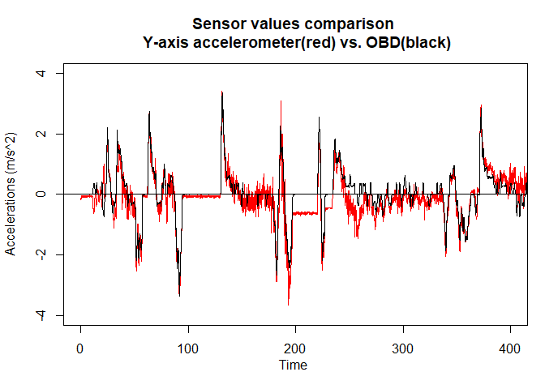

<!-- README.md is generated from README.Rmd. Please edit that file -->

# I Know How You Drive (ikhyd)

<!-- badges: start -->

<!-- badges: end -->

The goal of ikhyd is to make the analysis process of telematics data
easier.

## Installation

You can install the development version from
[GitHub](https://github.com/) with:

``` r
# install.packages("devtools")
devtools::install_github("issactoast/ikhyd")
```

# Prerequisite

## Package installation and loading

To reproduce the research result, the  `ikhyd` should be installed from
github page, , using the following  code:

``` r
# packages loading
devtools::install_github("issactoast/ikhyd")
```

After the installation, load package as follows:

``` r
library(ikhyd)
library(magrittr)
```

## Google API

To use the visualization functions, the google map aip key should be fed
into the function as an argument. Google API can be obtained [the Google
Maps Platform](https://cloud.google.com/maps-platform) by following the
registration
[instruction](https://developers.google.com/maps/documentation/geocoding/get-api-key).
The google map API service will charge $2 per 1000 requests however,
[$200 deposite will be added to the account per
month](https://cloud.google.com/maps-platform/pricing). Thus, the
personal usage is technically free but **you need to register the credit
card to use the service**.

## How to access to data set

`ikhyd` package contains seven telematics files;

1.  Sample route telematics: sample\_trip.csv
2.  Test route with OBD information:
      - trip\_with\_obd.csv
      - trip\_with\_obd.txt
3.  Driving telematics files:
      - driver1.csv
      - driver2.csv
      - driver3.csv
      - driver4.csv

Note that `trip_with_obd.txt` contains the OBD speed information which
combines with telematics data generated by smartphone,
`trip_with_obd.csv`.

To get the path of the each files, users can use `system.file()` in
**R**. For example, the follow code will give you the path of
`sample_trip.csv`;

``` r
system.file("extdata", "sample_trip.csv", package = "ikhyd")
#> [1] "C:/R/R-4.0.2/library/ikhyd/extdata/sample_trip.csv"
```

## See help and actual code

You can check out the actual code in this instruction by typing the name
of the **R** console. For example, examination the code of
`load_telematic_data()` will be as follows:

``` r
load_telematic_data
#> function(file_path, all_in_one = FALSE, ...){
#>     if (all_in_one){
#>         gps_data   <- get_trip(file_path, data_option = 1)
#>         acc_data   <- get_trip(file_path, data_option = 2)
#>         lacc_data  <- get_trip(file_path, data_option = 3)
#>         gyro_data  <- get_trip(file_path, data_option = 4)
#>         angle_data <- get_trip(file_path, data_option = 5)
#>         speed_data <- get_trip(file_path, data_option = 6)
#>         result <- list(gps_data = gps_data,
#>                        acc_data = acc_data,
#>                        lacc_data = lacc_data,
#>                        gyro_data = gyro_data,
#>                        angle_data = angle_data,
#>                        speed_data = speed_data)
#>         return(result)
#>     } else {
#>         result <- get_trip(file_path, ...)
#>         return(result)
#>     }
#> }
#> <bytecode: 0x0000000014d97660>
#> <environment: namespace:ikhyd>
```

Also, the help page of each function is available via
`?function_name()`.

``` r
?load_telematic_data()
```

## Load trip data

When you have a path of telematics data, you can load the data using
`get_trip()` with `data_option` arguments as follows:

``` r
# telematics file path
sample_trip_path <- system.file("extdata", "sample_trip.csv", package = "ikhyd")

# load data
sample_trip <- load_telematic_data(sample_trip_path, all_in_one = TRUE)
summary(sample_trip)
#>            Length Class      Mode
#> gps_data   6      data.frame list
#> acc_data   4      data.frame list
#> lacc_data  4      data.frame list
#> gyro_data  4      data.frame list
#> angle_data 4      data.frame list
#> speed_data 3      data.frame list
```

# Visualization

## GPS data

The snippet of `gps_data` for the sample trip looks as follows:

``` r
head(sample_trip$gps_data)
#>    time         x        y        z accuracy_horiz accuracy_vert
#> 1 0.000 -91.53799 41.66253 197.2922              5             4
#> 2 0.038 -91.53799 41.66253 197.2922              5             4
#> 3 0.079 -91.53799 41.66253 197.2821              5             4
#> 4 0.120 -91.53799 41.66253 197.2821              5             4
#> 5 0.153 -91.53799 41.66253 197.2821              5             4
#> 6 0.194 -91.53799 41.66253 197.2821              5             4
```

The GPS coordinates of the sample trip can be visualized with
`track_vis()` in `ikhyd` package as in Figure @ref(fig:trackvis):

``` r
track_vis(sample_trip$gps_data,
          api = your_google_api,
          zoom = 1)
```

<div class="figure">


<p class="caption">

Visulization of the GPS data of the sample trip by `track_vis()`

</p>

</div>

Figure @ref(fig:gpsspeed) shows the Speed information from GPS sensor
stored in `speed_data`, which can be visualized with `plot_speed()` as
follows:

``` r
plot_speed(sample_trip$speed_data, tripname = "the sample trip")
```

<div class="figure">


<p class="caption">

The result of `plot_speed()` code. It also supports many base plot
arguments such as `xlim` in **R**

</p>

</div>

## Accelerometer data

For accelerometer information, you can plot it by using `plot_acc()`
function with an option of smoothing parameter `rate`. Also note that
some base plot options such as `xlim` can be used.

Figure @ref(fig:plotacc) shows the result of the following code.

``` r
plot_acc(sample_trip$acc_data, rate = 0.2, tripname = "the sample trip")
```

<div class="figure">


<p class="caption">

The result of `plot_acc()` code. `rate` is the smoothing parameter of
low pass filter whose range between 0 to 1.

</p>

</div>

# Calibration

Kalman filtering and smoothing operation of the sample trip can be
reproduced by the following functions: `kalmanfilter_telematics()` and
`kalmansmooth_telematics()`.

The visualization of the Kalman filtered and smoothed telematics data
can be done by the `plot_telematics()` function in the package.

``` r
# telematics file for longer trips
obdtrip_path <- system.file("extdata", "trip_with_obd.csv", package = "ikhyd")
obdtrip_path_obd <- system.file("extdata", "trip_with_obd.txt", package = "ikhyd")
```

## Kalman filter

``` r
kalmanfilter_result <- kalmanfilter_telematics(obdtrip_path)
head(kalmanfilter_result)
#>    time       a_lon         a_lat         speed
#> 1 0.000 -0.07467497 -0.0001588679 -9.638167e-06
#> 2 0.008 -0.07553793 -0.0002927250 -1.418528e-03
#> 3 0.032 -0.06798833  0.0015284343 -2.687559e-03
#> 4 0.070 -0.06708123  0.0025836721 -5.449661e-03
#> 5 0.110 -0.05978903  0.0069970185 -7.162957e-03
#> 6 0.146 -0.05870658  0.0073854722 -1.039758e-02
```

``` r
plot_telematics(kalmanfilter_result)
```

<div class="figure">


<p class="caption">

Visualization of the Kalman filtering based calibration

</p>

</div>

## Kalman smoothing

``` r
kalmansmooth_result <- kalmansmooth_telematics(obdtrip_path)
head(kalmansmooth_result)
#>    time        a_lon         a_lat         speed
#> 1 0.000 -0.018178654 -0.0009477862 -5.521131e-05
#> 2 0.008 -0.015930304 -0.0027629604 -1.351008e-03
#> 3 0.032 -0.011211523  0.0004643929 -2.445627e-03
#> 4 0.070 -0.011028800 -0.0007278596 -3.118022e-03
#> 5 0.110 -0.005712119  0.0010311522 -3.774068e-03
#> 6 0.146 -0.005964552 -0.0040115553 -3.954390e-03
```

``` r
plot_telematics(kalmansmooth_result)
```

<div class="figure">


<p class="caption">

Visualization of the Kalman smoothing based calibration

</p>

</div>

# Comparison with OBD data

``` r
# load OBD trip data for the comparison 
obd_trip <- load_telematic_data(obdtrip_path, 
                                all_in_one = TRUE)

# load obd information and calculate acceleration
speed_data_obd <- get_obd_trip(obdtrip_path_obd)
speed_data_obd <- acc_from_obd(speed_data_obd)
```

Root Mean Square Error (RMSE) of accelerometer (y-axis), Kalman filtered
accelerations, and Kalman smoothed accelerations for the given trip are
calculated as follows:

``` r
rmse <- function(x, y){
    sqrt(sum((x - y)^2))
}

RMSEresult <- data.frame(
    Methods = "RMSE",
    Accelerometer = rmse(obd_trip$acc_data$y, speed_data_obd$dv_dt),
    KalmanFilter = rmse(kalmanfilter_result$a_lon, speed_data_obd$dv_dt),
    KalmanSmooth = rmse(kalmansmooth_result$a_lon, speed_data_obd$dv_dt)
)
knitr::kable(RMSEresult)
```

| Methods | Accelerometer | KalmanFilter | KalmanSmooth |
| :------ | ------------: | -----------: | -----------: |
| RMSE    |      118.2575 |     70.07717 |     55.95522 |

## OBD based speed and accelaration

### Speed comparison: OBD vs. GPS

``` r
obd_trip$speed_data$obd_speed <- speed_data_obd$speed
plot_speed(obd_trip$speed_data, col = "red",
           tripname = "OBD trip")
```

<div class="figure">


<p class="caption">

Comparion of Speed: GPS(red) vs. OBD(black)

</p>

</div>

### Acceleration comparison: Accelerometer vs. OBD

``` r
plot_data <- data.frame(time = obd_trip$acc_data$time,
                        acc1 = obd_trip$acc_data$y,
                        acc2 = speed_data_obd$dv_dt)
plot_acc_compare(plot_data, 
                 sensor_name = c("Y-axis accelerometer(red)", "OBD(black)"),
                 xlim = c(0, 400))
```

<div class="figure">


<p class="caption">

Comparion of Acceleration: Accelerometer(red) vs. OBD(black)

</p>

</div>

### Acceleration comparison: Kalman filtering vs. OBD

``` r
plot_data$acc1 <- kalmanfilter_result$a_lon
plot_acc_compare(plot_data, 
                 sensor_name = c("Kalman filtering(red)", "OBD(black)"),
                 xlim = c(0, 400))
```

<div class="figure">



<p class="caption">

Comparion of Acceleration: Kalman filter base(red) vs. OBD(black)

</p>

</div>

### Acceleration comparison: Kalman smoothing vs. OBD

``` r
plot_data$acc1 <- kalmansmooth_result$a_lon
plot_acc_compare(plot_data, 
                 sensor_name = c("Kalman smooth(red)", "OBD(black)"),
                 xlim = c(0, 400))
```

<div class="figure">


<p class="caption">

Comparion of Acceleration: Kalman smooth base(red) vs. OBD(black)

</p>

</div>

# Reproduce Heatmap visualization

``` r
# telematics file for driver 1 and 2
driver1_path <- system.file("extdata", "driver1.csv", package = "ikhyd")
driver2_path <- system.file("extdata", "driver2.csv", package = "ikhyd")

telematics_driver1 <- kalmansmooth_telematics(driver1_path)
telematics_driver2 <- kalmansmooth_telematics(driver2_path)
```

## Heatmap (V-A)

``` r
draw_vaHeatmap(telematics_driver1)
draw_vaHeatmap(telematics_driver2)
```

<div class="figure">


<p class="caption">

Reproduce V-A heatmap result for 2 drivers

</p>

</div>

## Heatmap (Lon-Lat)

``` r
par(mar = c(4, 4, .1, .1))
drawHeatmap(telematics_driver1)
drawHeatmap(telematics_driver2)
```

<div class="figure">


<p class="caption">

Reproduce Lon-Lat plot result for drivers; 1 and 2

</p>

</div>
